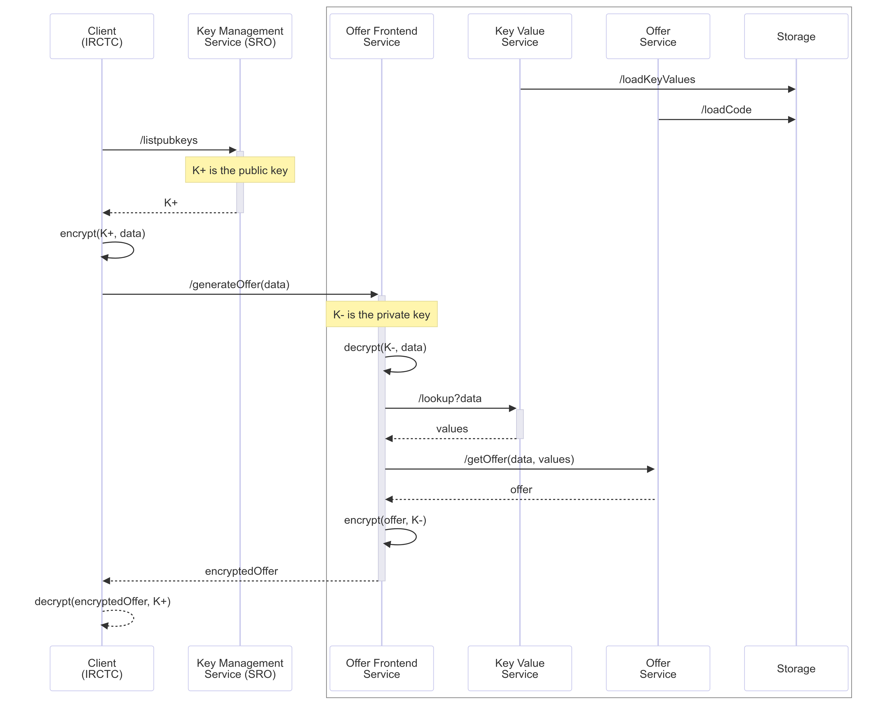

# DEPA Inferencing Request Flow
This explainer describe the end-to-end flow of requests through DEPA inferencing services. 

1. The key-value service periodically loads real-time signals data from storage into its memory. This data is formatted as a set of key-value pairs. It can be provided as full snapshots for full table rewrite, or as delta files which are merged with existing data. 
1. The inferencing service periodically loads code modules containing the business-rule engine (BRE) from storage. Code modules can be a combination of Javascript, WASM, and Tensorflow/Pytorch models. 
1. Clients (data providers) who wish to show offers obtain public HPKE keys from the KMS hosted by the SRO. 
1. The KMS responds with a list of active public keys. 
1. Client generates a fresh symmetric encryption key using one of the active public keys from the KMS, and its own public/private key pair, and encrypt the data using this symmetric key. 
1. Client sends the encrypted data to frontend service operated by the data consumer.
1. Frontend service decrypts the data using the private key obtained from KMS and the client's public key. 
1. Frontend service constructs a query from the data. The query can consist of multiple keys.
1. Frontend service encrypts the query using HPKE encryption. 
1. Frontend service sends the encrypted query to the key-value service. 
1. The key-value service decrypts the query. 
1. Key-value service performs a lookup on its in-memory state to obtain a set of values, one for each key. 
1. Key-value service encrypts these values using HPKE encryption. 
1. Key-value service sends the encrypted values to the Frontend service. 
1. The Frontend service decrypts the values. 
1. The Frontend service constructs an offer request by combining data received from the client with values received from the key-value service. 
1. The Frontend service encrypts the request using HPKE encryption. 
1. The Frontend service sends this request to the inferencing service. 
1. The inferencing service decrypts the request. 
1. The inferencing service invokes the rule-engine to generate an offer. 
1. The inferencing service encrypts the offer using HPKE encryption.
1. The inferencing service sends the offer back to the Frontend service. 
1. The Frontend service decrypts the encrypted offer. 
1. The Frontend service re-encrypts the offer with keys that are shared with the client. 
1. The Frontend service send the encrypted offer to the client. 
1. The client decrypts the offer and shows the offer to the data consumer. 

At this point, the data consumer may choose to accept the offer by clicking on the offer. At this point, if the data provider wishes to share personal data with the data consumer, the data provider should obtain the data principal's explicit and granular consent.