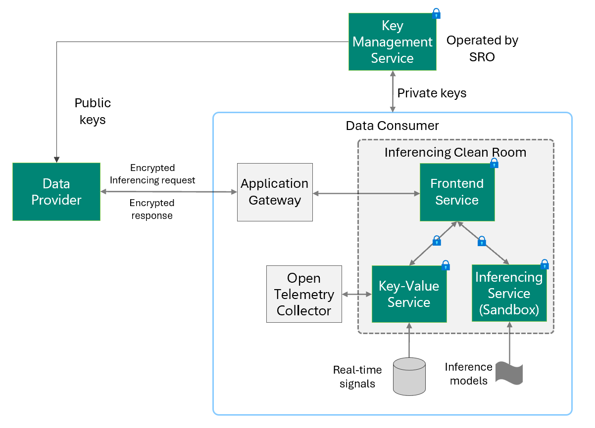

**Authors:**  
[Kapil Vaswani][1], iSPIRT 
[Pavan Adukuri][2], iSPIRT 

# Overview

DEPA Inferencing supports a broad class data sharing scenarios where a service provider (Data Provider) wishes to share sensitive data about a specific customer (Data Principal) with a partner (Data Consumer). Current privacy laws such as the DPDP Act require that data sharing respect the data principal's right to privacy e.g., using a consent manager to obtain explicit, fine-grained, timely, and revocable consent from the data principal. In scenarios where fine-grained consent is not feasible, DEPA Inferencing enables data sharing through the use of privacy-preserving technologies.

## Use cases
A sample use case for DEPA inferencing is data sharing between a 1P data provider and a 3P data consumer for the purpose of ad marketing. 

## Key terms and concepts

Before reading this document, familiarize yourself with these key terms and
concepts:

* _Data principal_: the entity to whom the data belongs
* _Data provider_: an enterprise company which holds personal data about data principals. 
* _Data consumer_: an enterprise company that wishes to consume data shared by the data provider for inferencing. For example, a data consumer may be a bank that wishes to make offers to 
*   _[Trusted execution environment (TEE)](#trusted-execution-environment)_: A
     combination of hardware and software that provides a secure environment.
     TEEs allow code to execute in isolation and protect data that exists
     within it. TEEs allow external parties to verify that the software does
     exactly what the software manufacturer claims it does—nothing more or
     less. Communication between the client and the TEE is encrypted, as is
     communication between the TEE and another TEE.
*   _DEPA inferencing service_: A real-time service that runs inside of a TEE, that can’t be accessed by any other workload or process running on the same machine. The service code is open source and externally verifiable. These services are not modifiable by their operators or infrastructure admins.
*   _Service operator_: An entity that operates real-time services to support DEPA inferencing
*   _Self Regulatory Organization (SRO)_: An organization that maintains DEPA inferencing services and operates centralized services for authorizing release of keys. 
*   _[Key management system](#key-management-systems)_: A centralized component hosted by an SRO that generates, manages and distributes cryptographic keys to clients and services.
*   _Attestation_: A mechanism to authenticate software identity with [cryptographic hashes](https://en.wikipedia.org/wiki/Cryptographic_hash_function) or signatures.

### Trusted execution environment

A [trusted execution environment (TEE)](https://queue.acm.org/detail.cfm?id=3456125) provides a level of assurance for data integrity, data confidentiality, and code integrity. A hardware-based TEE uses hardware-backed techniques to provide increased security guarantees for code execution and data protection within that environment.

Some of the key properties of a TEE include:

*   Applications that run in a TEE cannot be observed or modified by any other process running on the host machine.
*   Protect data-in-use. Data processed in-memory within the service is encrypted.

### Cloud platform

Services running in TEE should be deployed on a cloud platform that supports necessary security features. See the [Public Cloud TEE requirements explainer][9] for more details.

## Privacy considerations

In the proposed architecture for the DEPA inferencing services, we’ve made the following
privacy considerations:

*   Service operators can run real-time services on a public cloud platform that supports the necessary security features. 
*   Privacy protection of the DEPA inferencing service and the binary version of the virtual machine’s guest operating system are externally verifiable.
*   DEPA inferencing services run in a TEE.
*   Service code, APIs, and configurations are open source and externally verifiable.
    *   Note: Closed-source proprietary code can run within a TEE. In this trust model, closed-source proprietary code execution is allowed for certain use cases where execution is limited to another sandbox in the same TEE that preserves the same privacy considerations and security goals.
*   The service code is attested. 
*   Data sent from the client is not persisted.
*   Sensitive data will not be exfiltrated out of the service.
*   The service operator is not able to access any sensitive data processed by
    the service.
*   No entity can act alone to gain access to data from clients used to
    facilitate the DEPA inferencing information flow.

## Security goals

*   Data in transit from client to real-time service is encrypted (client to
    service communication is encrypted).
*   Communication between two different TEEs is encrypted.
*   Cloud providers and service operators can not observe anything in a TEE.
*   Sensitive data cannot be logged. Prevention of sensitive data logging is enforced by security policies that are attested at service startup.
*   Logs, core memory dumps, crashes, and stack traces do not reveal sensitive
    information.
*   Data consumers cannot access decryption keys in cleartext.

## Trust model

This section describes the trust model for DEPA inferencing services. In this context, trust is based on cryptographic verification by external parties. The model is expected to be trusted by all entities.

### Root of trust

A root of trust in this context implies that all other trust in the system can be logically derived from it. For the DEPA inferencing services, the cloud platform and hardware manufacturers are at the root of trust.

### Entities with trust

The cloud platform as an entity is considered trusted in this model: 

*   Secure virtual machine backed by TEE hardware on which DEPA services service will be hosted, is trusted. 
*   [Key management system](#key-management-systems) is trusted.

## System overview

Data consumers can use DEPA inferencing services to perform several different actions (such as lookup real-time data as well as executing inferencing). There are several entities that operate together in the systems.

*   The [clients](#clients) send encrypted requests to a DEPA inferencing service. To encrypt these requests, the client prefetches and caches the public key from a key management system.
*   The DEPA inferencing services [communicates with the client](#client-to-service-communication) to return encrypted responses.
*   [DEPA inferencing services](#depa-inferencing-services) runs within a TEE, and communicates with two key management systems to prefetch private keys to decrypt and process the request.
*   A trusted and confidential [key management system](#key-management-systems) maintain services and databases to generate and distribute public and private keys.

### Clients

Client software hosted by the data provider periodically fetches a set of public keys from the public key
hosting service.

Public keys are cached client-side with a fixed TTL (in order of days) and are considered valid by the service for sufficiently longer. New versions of keys are prefetched before the expiration time of the previous set.

The client encrypts the request payload with a version of the public key. Then, the client sends the request and the version of the public key to the DEPA inferencing service.

### Client-to-service communication

Client to DEPA inferencing service communication is encrypted using
[Bidirectional Hybrid Public Key Encryption (HPKE)](https://www.rfc-editor.org/rfc/rfc9180.html#name-bidirectional-encryption).

#### Request encryption

To encrypt the request, the client establishes a connection with the DEPA inferencing service endpoint. This ensures that the client is talking to the correct operator and server instance. This alone does not guarantee that the operator can be trusted to handle the request.

The client encrypts the request with the public key. The client sends the request, which includes a clear text message indicating the version of the public key, to the DEPA inferencing service.

The client won't directly verify the identity of the destination service. Instead, the request remains secure because the private keys are only available to the service after it has been attested.

#### Request decryption

Upon receiving a request, the DEPA inferencing service checks the version of the public key and looks up corresponding private keys from its in-memory cache.

The DEPA inferencing service decrypts the request using split private keys, processes the request and then returns an encrypted response back to the client. 

#### Response protection

The response is encrypted  with a [key material and nonce derived from HPKE context](https://www.rfc-editor.org/rfc/rfc9180html#name-bidirectional-encryption). HPKE does not require additional round trips or have extra latency overhead.

### DEPA inferencing services

Each DEPA inferencing service is hosted in a secure virtual machine (TEE). Secure virtual machines run on physical hosts powered by secure hardware processors. 

The DEPA inferencing service sends requests to the key management system to fetch private keys and public keys at service bootstrap. Before such keys are granted to the service, measurements of the DEPA inferencing service binaries and guest operating system running on the virtual machine are validated against a hash of the open source image; this validation process is termed an attestation.

*   The DEPA inferencing service sends requests to private key hosting services to pre-fetch private keys. Private keys are granted to a DEPA inferencing service only after attestation.
*   DEPA inferencing services can send requests to other DEPA inferencing services or other trusted entities. Requests to other DEPA inferencing services would be encrypted using a public key and decrypted at the destination using the
corresponding private key. Refer to the [DEPA inferencing service explainer](https://github.com/depa-inferencing/docs/blob/main/depa_infernecing_services_api.md)
as an example of an architecture where a DEPA inferencing service communicates with other DEPA inferencing services.
*   Public and private keys are periodically prefetched and cached. The key caching TTL within the service is in the order of hours.

### Key management systems

A _key management system_ includes multiple services that are tasked with:

*   Generating a public-private key pair used for encryption and decryption.
*   Provisioning keys to clients.
*   Provisioning key pairs to DEPA inferencing services.

#### Public and private keys

Every public and private key pair has a corresponding version number. 

Public keys are used to encrypt requests. Private keys are used to decrypt the request. To perform decryption, the version of the private key must correspond to the version of the public key that is used for encryption.

Public keys have a client side time-to-live (TTL) of N days. Corresponding private keys should have a TTL of at least N+1 days.

#### Data consumer authentication by SRO

When an data consumer onboards to a [cloud platform](#cloud-platform) to [deploy](#deployment-by-adtechs)
and operate DEPA inferencing services, they need to be enrolled with SRO. Refer [here][7] for more details.

## Initial plans for release and deployment

### Release by SRO

*   Developers author open source [Key Management Systems](#key-management-systems) code and SRO releases source code to an open source repository (GitHub). 
*   SRO is publishing [DEPA inferencing services](#depa-inferencing-services) source code and build artifacts to an open source repo in [github.com/depa-inferencing](https://github.com/ispirt/depa-infernecing) org.

### Deployment by data consumers

Data consumers will deploy DEPA inferencing services from an open source repository that follow helper guides provided by iSPIRT. This includes running binaries of the
service in the TEE setup specific to a cloud platform. Data consumers are responsible for the deploying DEPA inferencing services operated by them.

Data consumers will define and be responsible for the Service Level Objective (SLO) and  Service
Level Agreement (SLA) of the system deployed by them.

### Deployment by SRO

The SRO will deploy [Key Management System](#key-management-system) on every [Cloud Platform](#cloud-platform) that is supported.

## DEPA inferencing services

iSPIRT is proposing the following open source services for DEPA inferencing that run in TEEs and are operated by data consumers.

### Key/value services

Lookup service for fetching real-time signals from data consumers. This is a critical path dependency for many scenarios where data from providers must enriched using the data consumer's data before running inferencing. 

### Inferencing services

Refer to the [DEPA inferencing services][6] explainer for more information. 

Refer to all DEPA inferencing explainers [here][5].

[1]: https://github.com/kapilvgit
[2]: https://github.com/pavanad
[5]: https://github.com/ispirt/depa-inferencing/docs#depa-inferencing-services
[6]: https://github.com/ispirt/depa-inferencing/docs/blob/main/depa_inferencing_services_api.md
